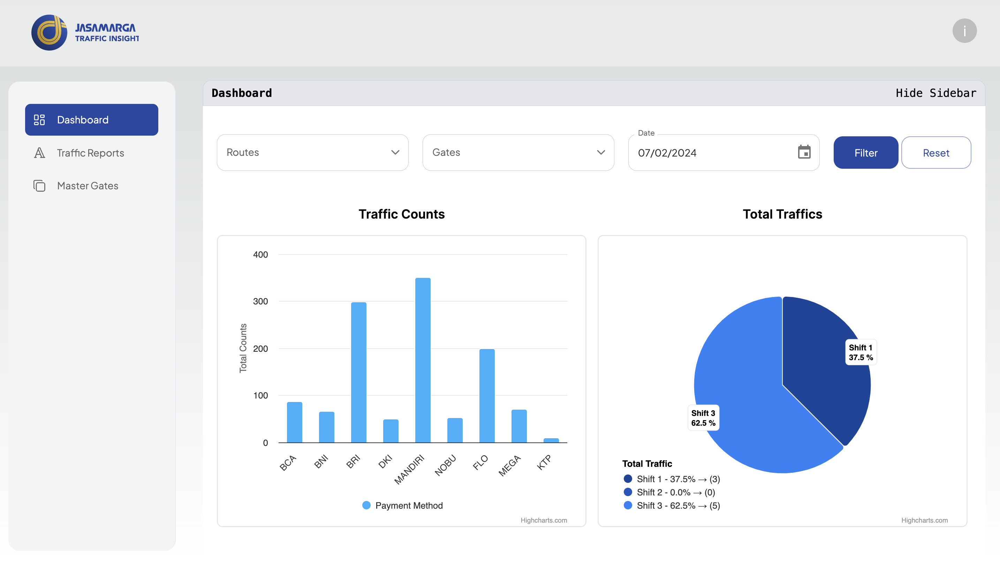
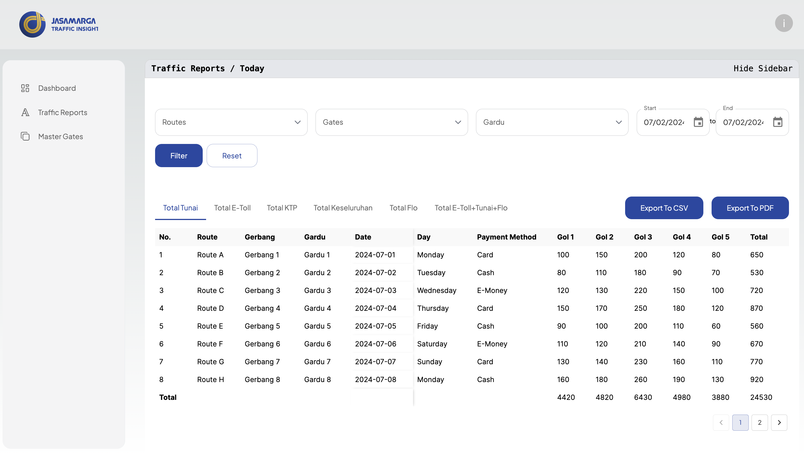
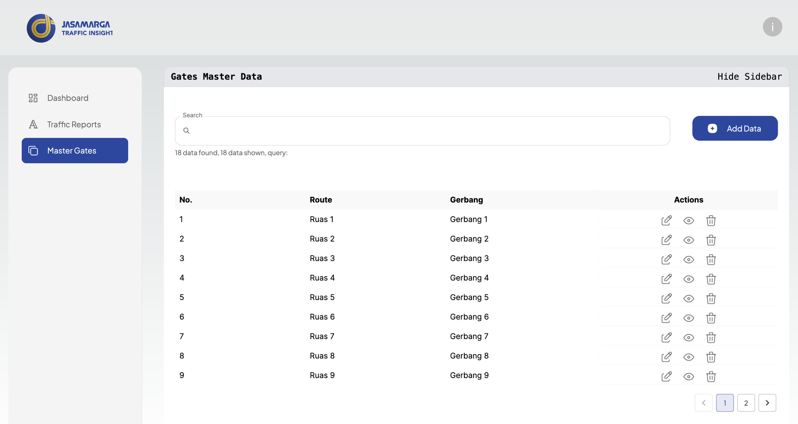

# My Traffic Insights Application Project

This is a project for the recruitment process at [PT Jasa Marga (Persero) Tbk](https://www.jasamarga.com/). The project is a web application that provides insights into traffic data. The application has built-in features such as master gates, dashboard analytics, and reporting. The application is built using `Next.js, Tailwind CSS, and TypeScript`.

## Getting Started

First, make sure you have Node.js and npm (or yarn) installed on your system. Then, follow these steps to get the project up and running:

### Installation

1. Clone the repository:
```bash
git clone https://github.com/hayati-uyun/Fe_Test_2.git
```
2. Navigate to the project directory:
```bash
cd Fe_Test_2
```
3. Install the dependencies:
```bash
npm install
# or
yarn dev
```

### Environment Variables

You can define environment variables in a `.env.local` file. The following environment variables are required:

```bash
AUTH_SECRET=
API_URL=
```

### Running the Development Server

To start the development server, run the following command:

```bash
npm run dev
# or
yarn dev
# or
pnpm dev
# or
bun dev
```

Open [http://localhost:3000](http://localhost:3000) with your browser to see the result.

### Pages

#### Login

This page is used to login to the application. Open [http://localhost:3000/](http://localhost:3000/) to see the login page.


#### Dashboard

This page is used to display the analytics chart with filtering. Open [http://localhost:3000/dashboard](http://localhost:3000/dashboard) to see the dashboard page.


#### Reporting

This page is used to display the reporting data traffic with filtering and exporting. Open [http://localhost:3000/traffic-reports/today](http://localhost:3000/traffic-reports/today) to see the reporting page.


#### Master Gates

This page is used to display and CRUD data of the master gates. Open [http://localhost:3000/master-gates](http://localhost:3000/master-gates) to see the master gates page.


## Contact Me for More Information

If you have any questions or need further assistance, feel free to contact me at 

Email 💌: [hayatiqurrotuluyun@gmail.com
](mailto:hayatiqurrotuluyun@gmail.com)

LinkedIn: [Hayati Qurrotul Uyun](https://www.linkedin.com/in/hayati-uyun/)

